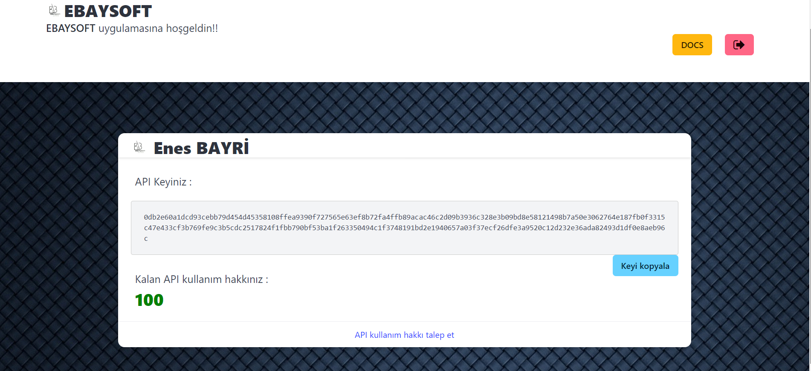
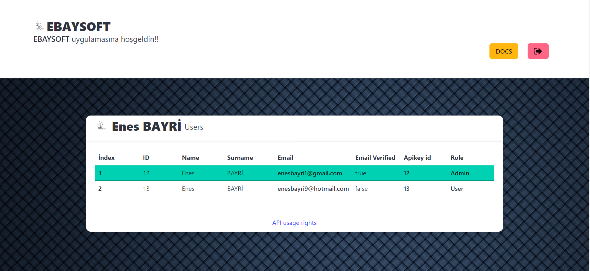
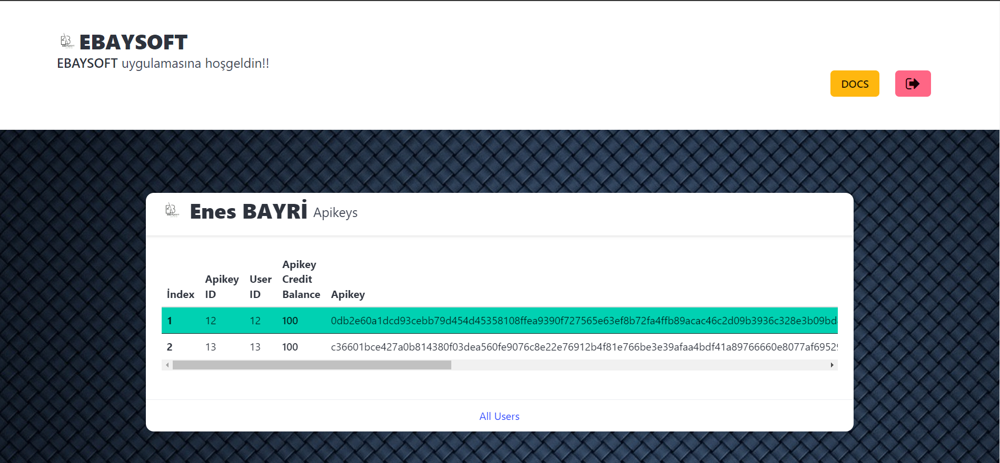
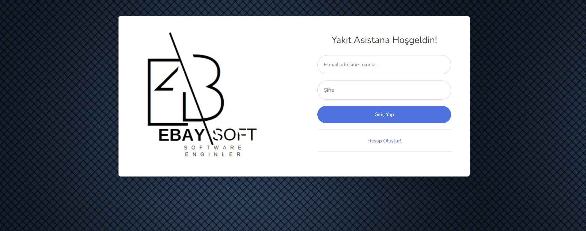
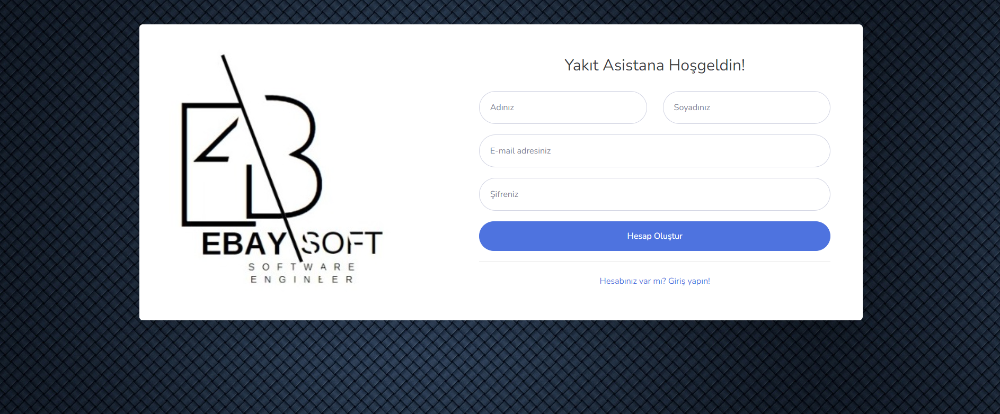
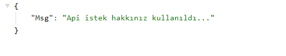
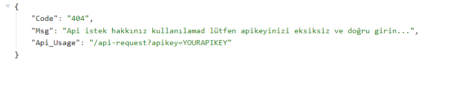

# KeyControlHub

### EBAYSOFT

<br>
KeyControlHub is a template for building API key-controlled web applications. It simplifies the process of managing user logins, API key validation, and admin controls, allowing developers to focus on custom features without writing the core logic from scratch. 

With KeyControlHub, you can quickly set up a system where users can generate API keys, make requests, and admins can manage users and their API key usage limits.

## Features

- **User Registration & Login:** Users can register and log in to receive a unique API key.
- **API Key Management:** Users can view their API key, remaining request limits, and personal information.
- **Admin Panel:** Admins can manage users, view all users' API keys, and control remaining request rights.
- **Real-Time API Key Requests:** Users can request API keys, and admins can respond in real-time.
- **API Usage Tracking:** API keys come with limited usage rights, which can be adjusted by admins.

## API Endpoints

### 1. User Authentication
- `GET /register`: View register page.
- `GET /login`: View login page.
- `POST /register`: Register a new user.
- `POST /login`: User login and token generation.

### 2. Admin Management
- `GET /`: Retrieve a list of all users API keys, and request limits.
- `POST /all-apikeys`: Approve a user's API key request.

### 3. API Request Example
- `GET /api-request?apikey=YOUR_API_KEY`: Make an API request using your key.

### 4. API Key Management
- `GET /`: View the user's API key and request limits.

## Usage

1. Clone the repository:
    ```bash
    git clone https://github.com/enesbayri/KeyControlHub_NodeJS.git
    ```

2. Install dependencies:
    ```bash
    npm install
    ```

3. Set up environment variables:
    Create a `.env` file with the following variables:
    ```bash
    PORT = 3035
    SECRET_SESSION= Your Session Secret Key
    SECRET_JWT_KEY= Your JWT Secret Key
    EMAIL= Your email
    PASSWORD= Your password

    URL=http://localhost:3035/
    ```

4. Run the application:
    ```bash
    npm start
    ```

5. Open `http://localhost:3035` in your browser.

## Admin Interface

- After logging in with admin credentials, you will be automatically directed to the admin panel at "/".
- View all users and manage their API keys and usage rights.

## Application Screenshots

Below are some screenshots of the KeyControlHub interface.

### User Dashboard


### Admin Panel /Users


### Admin Panel /Apikeys


### Login Page


### Register Page


### API Request


### API Request Error


## Contributing

Feel free to fork this repository and contribute by submitting pull requests.

## License

This project is licensed under the MIT License.
